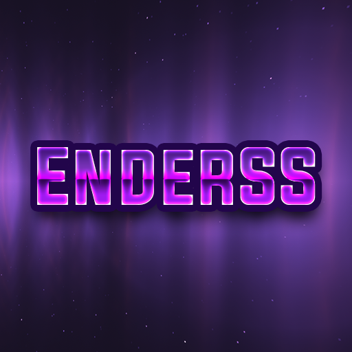

<div align="center">
    
</div>

# EnderScreenShare by Endxxr
>Supported Minecraft Versions: 1.8.8 - 1.20.1

Powerful and lightweight screenshare plugin for Spigot, Bungeecord and Velocity!

The idea of this plugin was born from the need to have a free screenshare plugin that works on every platform and at the same time be powerful and simple to use. 


For report a bug or support: 

> Discord Server: https://discord.gg/PhMbS3jtAJ 
>
> Discord: @endxxr
> 
> Telegram: @pellicani

# Wiki
An in-deep explanation of the plugins and its features is avaiable on the [wiki](https://github.com/Endxxr/EnderScreenShare/wiki). 
Below you'll find a resume but it's strongly suggested to read it.

# Features
✓ Full of commands and customizable messages

✓ Title, Buttons and notifications

✓ Reports

✓ User friendly 

✓ Lightweight

✓ PlaceholderAPI support

✓ Automatic ban on quit (with LiteBans support)

✓ Command Blocker when frozen 

✓ Automatic teleports at the start and end of the control

✓ Protections for the screenshare world and the player

✓ Private chat between the player and the staffer with LuckPerms support

✓ Available in both English and Italian language (check lang folder)

## Soft-Dependencies
Other plugins that are not required but are recommended to use with EnderSS

- [PlaceholderAPI](https://www.spigotmc.org/resources/placeholderapi.6245/) - For placeholders
- [LiteBans](https://www.spigotmc.org/resources/litebans.3715/) - For automatic ban on quit
- [LuckPerms](https://www.spigotmc.org/resources/luckperms.28140/) - For private chat between the player and the staffer

## Getting Started

The plugin uses [bStats](https://bStats.org) to collect anonymous data about the plugin's usage. You can disable it in ``plugins/bStats/config.yml``.

### Spigot (Backend)

#### Requirements

- Java 11 or higher
- Spigot 1.8.8 or higher

#### Installation
- Download the plugin from Spigot or GitHub releases 
- Put the ```.jar``` file in the plugin folder of your Spigot server 
- Start or restart your server
- Enjoy!

### Bungeecord / Velocity (Proxy)
#### Requirements

- Java 11 or higher
- Velocity 3.x.x or any recent Bungeecord version
- 2 or more Spigot server connected to the proxy

#### Installation
- Download the plugin from Spigot or GitHub releases
- Put the ```.jar``` file in the plugin folder of your Bungeecord/Velocity server and eventually Spigot server
- Start or restart the proxy and eventually the Spigot server
- Enjoy!

## Build
To build the plugin, you need to have Java 11 or higher and Maven installed on your computer.
Run the following command in the root directory of the project:
````
mvn clean package
````
The .jar file will be in the ``\universal\target`` folder.

## Api
EnderSS has an API that allows you to interact with the plugin. The jar of the API is downloadable in the GitHub Releases.  
Make sure to add the plugin as a dependency in your project.

### Get the API
````
EnderSS api = EnderSSProvider.getApi();
````
